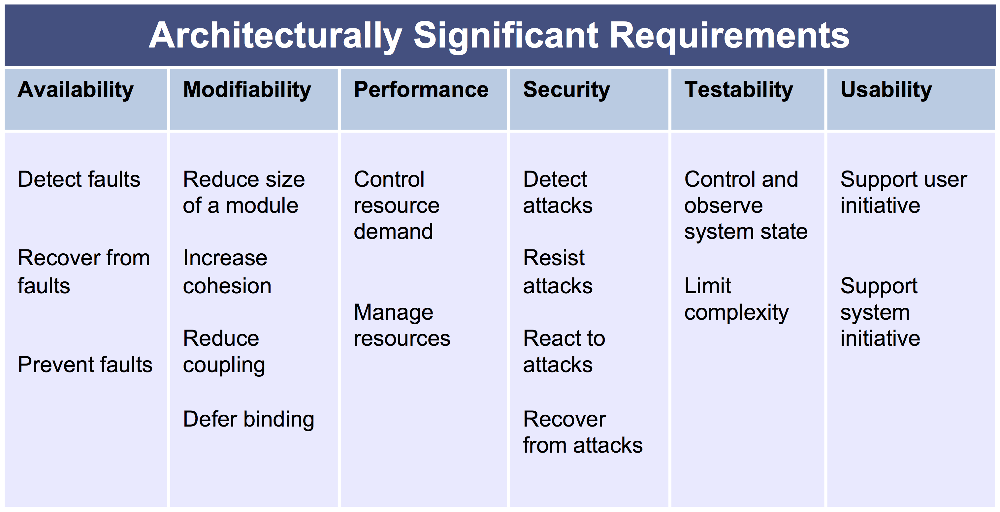

# Introductions
I am [Neil Ernst](http://neilernst.net), assistant professor in the Department of CS, formerly a senior researcher and consultant at the SEI. I've approached software architecture from both an academic/research perspective, as wel l as a consulting engineer. In my four years at the SEI, I helped evaluate, document, and design software architectures in government and scientific settings.

<!-- show Github and Slack channels -->

This course has two main objectives. One---**Documenting**---is to prepare you to prepare and describe architectures you will be responsible for. For example, you move out into a government IT job. You are asked to prepare a modernization strategy for the Department of Finance. You will present that strategy to senior leaders who want to know the technical and non-technical details about your plan.

The second objective---**Understanding**---is to enable you to work on the opposite side. Given a software system, come up with intelligent questions and analysis to understand a) how it works b) what key requirements it satisfies c) what evidence supports that.

# Course Format
This course is divided into a project, worth 50%, a midterm, worth 25%, and assignment(s), worth 15%. Participation will be marked as well and worth 10%. We meet twice a week. I intend to lecture for about 20-30 mins, then turn it over to a peer exercise for the next 20 minutes, and conclude with either more lectures or a summary. I am arranging a few guest lectures from architecture practitioners as well.

# Project outline
The main deliverable in this course is a major, term-long project you will do with 4 other students, in groups that I form. You will select a large, open source project, and generate a chapter-length document that completely describes the project's architecture. What exactly that comprises will be the subject of the lectures.

Your *individual* project mark will reflect your team's performance, adjusted by a peer / instructor participation factor. If you do **nothing**, you can expect a 0 for the project (and will fail the course).

Group projects are best summarized by Dickens:

> It was the best of times, it was the worst of times, it was the age of wisdom, it was the age of foolishness, it was the epoch of belief, it was the epoch of incredulity, it was the season of Light, it was the season of Darkness, it was the spring of hope, it was the winter of despair, we had everything before us, we had nothing before us ... (A Tale of Two Cities)

We will go into detail about functioning well in groups, but you should not assume that your group's problems will be an excuse for poor performance. Turn the *winter of despair* into a *spring of hope* as early as you can.

<!-- intros and background of students -->

# Software Architecture - What Is It?

(we brainstormed ideas on the blackboard)

## Definitions

Here are three definitions. 

1. "the important stuff ... whatever that is ([Martin Fowler](http://files.catwell.info/misc/mirror/2003-martin-fowler-who-needs-an-architect.pdf))" 
2. “Architecture is the decisions that you wish you could get right early in a project.” Ralph Johnson
3. the “...significant design decisions (where significant is measured by the cost of change).” (Grady Booch)

<!--  (we discussed each definition)  -->

## Our definition
Here is the definition we will use. It is designed to orient us to the notion that there is not just one **thing** to call the architecture, but rather a set of *structures* that help us reason about what the system is doing.

> The software architecture of a system is the set of structures needed to reason about the system, which comprise the software elements, relations among them, and properties of both. (text p.4)

<!-- first lecture here -->

---
Title: SENG480a/CSC485b/CSC578b---Lecture 2
Author: Neil Ernst
Date: Jan 10, 2019
---

# Recall Our Definition
Here is the definition we will use. It is designed to orient us to the notion that there is not just one **thing** to call the architecture, but rather a set of *structures* that help us reason about what the system is doing.

> The software architecture of a system is the set of structures needed to reason about the system, which comprise the software elements, relations among them, and properties of both. (text p.4)
> 

# Other "architectures"

* *Enterprise Architecture* - business structures and the processes that connect them. see the Zachmann framework, DODAF, among others. Oversee the organization's entire portfolio of IT assets including staff, hardware (switches, PCs, servers, cloud), software (payroll systems, OS, custom software, databases).
* *System Architecture* - as with all of these terms, overused, but in my view, this describes the people who do system engineering activities. Oversight of end-to-end production, including hardware components, managing subcontractors, ensuring the connections make sense between subsystems, preparing documents for design reviews with major stakeholders, understanding budgeting and legal "in the large"
* *Hardware Architecture* - chip and circuit design, network design, FPGAs, etc.

# Why "Document"
There are three major modes for creating a software model. Recall that models - blueprints, computer code, boxes and lines, tables of contents - are supposed to be useful abstractions when the real world is too complex to reason with. [Per Martin Fowler](https://martinfowler.com/bliki/UmlMode.html), we have three main modes for diagrams:

- Diagram as Sketch
- Diagram as Blueprint
- Diagram as Executable

The point is that a diagram that works in one context, will not usually work in the others. A nice piece of research by Microsoft Researchers showed that a whiteboard functioned as an 'information radiator'; the sketches done in the moment were a reference for the developers. But only while the project was in full flush. If you look at a diagram like this:

 
you can see why. I hope. 

## Problems
- what are we learning? There are lots of boxes? Messages are being passed around? 
- The applications involved and the elements they comprise?
- The system has multiple tiers?
- The data, control, and communication mechanisms that are used?

What is missing:
- when and where do things exist? 
- what is going on at runtime?
- how do we deploy this? 
- what does each element do wrt requirements? responsibilities?
- what are the connections?
- what do the colors mean?

The other modes, blueprint and executable, are really about making models do more than communicate in the short term. In the Blueprint approach, we want to *hand off* our models to downstream users, like architects do in the real world for buildings. 

In the Model as Executable, we are actually writing the program by building the model. This is most common where there are tight constraints on safety or security, such as in automotive. In this mode, we use a tool like Simulink to draw block diagrams that a verified compiler can translate into safe (ish) C code. 


## Anecdote: becoming an architect

>I’m not exactly sure when I became a software architect. I do remember the first time someone else called me one. We were at an important client meeting. The client asked a really tough technical question. No one had a good answer at that moment so the project manager chimed in, Michael is the architect on this project. He’ll dig in and send you an update by the end of the week.
**Just like that I was a software architect**. The rush of power. The anticipation of career advancement. I am an architect! Soon a slight feeling of dread set in. I am an architect. Now what do I do? How is being a software architect different from being a software engineer?
In the years since that day I’ve come to realize that being a software architect is more than just a role on a team. Architects are leaders, but being a software architect also implies a person who thinks about software design in a certain way. No matter what the title on your business card reads (mine still reads software engineer, my choice), you can be a software architect. **The best development teams are filled with architects**.
(Michael Keeling, "Design It!" p. 3)

<!-- here I surveyed the class about their past experience in programming, design, and architecture -->

Every software system has an architecture. That is not very helpful, however, because a lot of the time the architecture is implicit or tacit. It is captured in someone's head, who may have left the project. It is an evolved version of whatever was captured in a Powerpoint slide from 2015. It is a [market-ecture,](http://blog.centrify.com/wp-content/uploads/2014/09/ed-marketecture-samsung-lg.png) a vision had by a business manager and explained to the customer. 

<!-- show examples of each idea -->

[Michael Keeling](https://twitter.com/michaelkeeling) is a team lead/architect/developer at IBM Watson. His book "Design It" is one of several recent books that is moving the flawed concept of an architect from this guy:

[The Matrix: Architect](https://www.youtube.com/watch?v=ZKpFFD7aX3c)

To a more team-oriented, role-based definition. A role based definition means there isn't necessarily a single person who is "architect", but rather a shifting set of people play that role, depending on what expertise and leadership is necessary.

# Why Care
Anyway, Michael gives 7 reasons why we care about architecture in his book.

1. **Divide and conquer the problem**. Architecture shows us how to transition up and down the abstraction hierarchy (system purposes down to individual lines of code). 
2. **Help manage tasks and help people work collaboratively**. The architecture helps us figure out who does what.
3. **A common language for the system**. Styles, patterns, common syntax like UML.
4. **Force us to look beyond "function" and into qualities**.
5. **Connect business goals to software implementation**.
6. **Avoid high-cost mistakes by focusing on the hard decisions**.
7. **"The best architectures create options"**. We will talk about the idea of a "architecture runway" later in the course.

## Why Architecture from SAIP: (Chapter 2)
1. Enable system quality attributes
2. Reason about change
3. Predict system quality
4. Enhance communication
5. Carry early design decisions
6. Constrain implementation
7. Influence org structure
8. Enable evolutionary prototyping
9. Improve cost/schedule estimation
10. Supply a transferable model
11. Assemble components
12. Restrict alternatives
13. Provide training

# Structures
What structures do we care about (read: want to be able to reason and ask questions about) when we want to replace a Bridge? 

- **Physical structures** - can the bridge support traffic, not break down, not cost too much to maintain? 
- **Transportation structures** - how much traffic can this thing manage? What types of traffic? Can boats get by?
- **Aesthetic structures** - Is it attractive? Does it make the city iconic?
- **Personnel structures** - Who will work on the project? When do they need to come in? 
- **Logistics structures** - Where do the materials come from? What materials do we need?
- **Financial structures** - How much does it cost? What types of financing can we get? 

What types of structures do we care about in building a reasonable large piece of software?

In the SAIP approach, the main categories of software structures are:
- module structures
- component and connector (runtime, C&C) structures
- allocation structures

## Implications
* Systems have many (many) structures. We need to filter the ones we really care about.
* No one structure is *the* architecture. 
* Every system has an architecture, which may be more or less visible in the docs.
* Important for this course and project: the diagram is not the architecture. We need information on how the diagram answers our key questions. 
* We can only define whether an architecture - set of structures - is good or not, by understanding how well it meets its quality requirements, and ultimate business or mission goals.

# Communication vs Documentation

We need to keep in mind, as we seek to document and understand the system, why we are doing this. After all, our time is not free - we could be doing other things. We only document something if it is worth the cost. In this course, naturally the cost is near-infinite for *not* documenting (you fail), but in practice it is a more difficult decision. A colleague and I once spent 7 days at a  company site to help them document their large-scale, high-performance system with 20 other people. It was worth the cost. But even there, after 7 days, we could only make a small dent in the overall system complexity. 

## 7 Principles for Effective Documentation
1. Write for the reader
2. Avoid repetition
3. Avoid ambiguity
4. Organize and standardize
5. Record rationale
6. Keep it current 
7. Review the documentation

(source: Documenting Software Architectures, Bass et al. 2011)

# References
[^Conteneo]: https://www.slideshare.net/innovgames/visible-architectures

---
Title: SENG480a/CSC485b/CSC578b---Lecture 3
Author: Neil Ernst
Date: Jan 21, 2019
---

# Reading and Understanding Code
One of your most frequent tasks as a programmer is not just *writing* code, which we focus on in university; but also *reading* code. 

Where are some places *reading* code will be important?

Code reviews for your team; [understanding library functions](https://hackernoon.com/im-harvesting-credit-card-numbers-and-passwords-from-your-site-here-s-how-9a8cb347c5b5); copying from StackOverflow; maintaining old legacy systems.


# Context and Preliminaries
The real preliminary of course is that you have a knowledge of basic software concepts, such as loops, methods, memory addresses, pointers, closures, lambdas, even monads or other esoterica. If you aren't trying to learn the language (and reading code is a great way to do that), then you are asking for trouble. For example, what does this mean?

## Examples
```
data {
  int<lower=0> N; 
  int<lower=1,upper=10> project[N];
  vector[N] x;
  vector[N] y;
} 
parameters {
  vector[10] a;
  real beta;
  real<lower=0,upper=100> sigma;
} 
transformed parameters {
  vector[N] y_hat;

  for (i in 1:N)
    y_hat[i] = beta * x[i] + a[project[i]];
}
model {
  y ~ normal(y_hat, sigma);
}"""
```

It helps to know about statistics and probabilistic programming before trying to sort it out (we are simulating a series of linear regressions using [PyStan](https://pystan.readthedocs.io/en/latest/)). 

What about 
```
X[⍋X+.≠' ';]
```

That's <a href="https://en.wikipedia.org/wiki/APL_(programming_language)">APL</a> for sorting a matrix. Apparently.

## Steps
There is no substitute for reading a lot of code. Books like 500 Lines can help, as can blog posts and mailing list posts (e.g., why was [Linus so pissed](http://lkml.iu.edu/hypermail/linux/kernel/1510.3/02866.html) about some pull request?) (Note that there are much better ways to handle this than being abusive to your co-workers.)

- get the source, or as much as you can
- replicate the build environment. Strictly speaking, you want something equivalent to a 'requirements.txt' with fully specified version numbers. If you are lucky, you get a Maven script to start from; if not, you get a 500 line Makefile to figure out. Watch those tabs!
- more likely, you will need to reconstruct the build environment from docs. 
- occasionally this means figuring out from the source which e.g. version of C++ was being used.
- develop a source of tools for code reading:
	+ favourite IDE
	+ grep, sed etc.
	+ reverse engineering tools: Rigi, Intellij, call graph constructors, Understand. In all likelihood you will use several tools in combination.
		* We saw an example of Understand on a Commander Keen game
	+ valgrind or other profilers
	+ git and version control analysis (diffs, blame, etc)
	+ step through with a debugger/print statements
	+ increase the debug level for logging messages

# One Approach
1. build the code executable 
2. run the tests
3. trace the thread of execution
4. note down what seem to be key classes.

> Djikstra: "The purpose of abstraction is not to be vague, but to create a new semantic level in which one can be absolutely precise"

## Find the Entry Point
- key events, main() method, initializations - often tests can be a good document for this.

There isn't always an obvious entry point, e.g. in control systems or other long-lived software (we really don't want to be in nuclear reactor shutdown mode too much!)

## Flowchart
Flowcharts are often seen as relics of the 80s:

[XKCD](https://xkcd.com/518/)

But in reality, they can be very effective at tracing execution flow, or (in a business context), business process logic. The other thing to keep in mind is that you might eventually want to translate your explorations into a communique for others; diagrams and notes can be important artifacts. In some ways you need a 'field book' like any decent archaeologist. Unless you are the relic-stealing, Nazi-fighting variety.

## Grep for keywords
Good keywords: `open, error, save, load` ... plus program specific ones (from the domain model). So perhaps another code reading approach is, figure out the domain model. Chances are a) they are using different words than the ones you might use (Client instead of Customer) or b) there are words you haven't seen before. Acronyms are a great example of this. Figuring out what AWT means (Abstract Windowing Toolkit) will greatly help code comprehension. What if we don't know what "asynchronous I/O" is about?

## View the hierarchy:
Ignore the lower level details, and focus on the method names and signatures, class names, and so on. A good IDE will help with this. In PyCharm, for example, you can pretty quickly navigate around the source. 

## Look at file structure
Someone put files in various folders for some reason. One of the challenges with code reading - and archaeology - is that you have to be careful assigning intent to actions. Think about excavating a Minoan village in Greece. You see some interesting pottery shards that seem to tie this village to Chinese traders (say). But is it really that narrative? Or is it equally likely that what you think is happening is in fact someone who dug a pit in the middle ages, and threw the pottery shards in much later?

## Rewrite the Code
As you move through it, write comments and fix variable names. Assumes existence of unit tests. Why?

# Other strategies?
We discussed some of our past approaches to code reading.

# Program Understanding Strategies
* Bottom Up
* Top Down
* Opportunistic or Knowledge based

These do what you would expect: begin by tracing the code at a low level; begin by looking at package and file organization; or begin by picking an interesting question (where does the credit card get sent?). Researchers have shown that we do all three when it comes to understanding programs.

# How Many People Did the Reading?
We broke into teams to read the code for a piece of the system, and had a group discussion about what we learned.

(then we walked through http://aosabook.org/en/500L/a-web-crawler-with-asyncio-coroutines.html)

Showed how to construct a mental model of what is happening. Go through, look for obvious code that can be ignored, highlight things I need to lookup (IOCP?). External calls to other files - how do these things link together?

If you haven't seen them before, you might notice new CS concepts: generators, closures, callbacks,etc

# References
* http://wiki.c2.com/?TipsForReadingCode
* Working Effectively With Legacy Code, Michael Feathers
* [How Do Program Understanding Tools Affect How Programmers Understand Programs?](http://citeseerx.ist.psu.edu/viewdoc/download?doi=10.1.1.400.223&rep=rep1&type=pdf) Storey, Wong, Mueller. ICPC 1997.

---
Title: SENG480a/CSC485b/CSC578b---Lecture 4 - Stakeholders and Requirements
Author: Neil Ernst
Date: Jan 13, 2018
---

# Stakeholders
We've mentioned a few times that what matters is who the system is *for*, not what the system *does*. Of course, there are multiple different sets of interested parties. These are the stakeholders.

Back to our Blue Bridge example. Who are the stakeholders in this project?

For the project, I've asked you to fill in a table from the Rozanski and Woods approach. It looks something like this:

| Role | Concerns | Instances |
|-----|----------|-----------|
| Acquirers |	Oversee the procurement of the system or product | |
| Assessors |	Oversee the system’s conformance to standards and legal regulation | |
| Communicators |	Explain the system to other stakeholders via its documentation and training materials | |
| Developers |	Construct and deploy the system from specifications (or lead the teams that do this) | |
| Maintainers |	Manage the evolution of the system once it is operational | |
| Production  Engineers |	Design, deploy, and manage the hardware and software environments in which the system will be built, tested,  and run | |
| Suppliers |	Build and/or supply the hardware, software, or infrastructure on which the system will run | |
| Support  Staff |	Provide support to users for the product or system when it is running | |
| System Administrators |	Run the system once it has been deployed | |
| Testers |	Test the system to ensure that it is suitable for use | |
| Users |	Define the system’s functionality and ultimately make use of it | |

Let's fill that in for the Blue Bridge example.

Why do we care about who the stakeholders are? These are the people with varying levels of need and interest in a system. At the least, we need to think about who the *documentation* stakeholders are. If we are doing a system design, we need to think about who should be consulted. And at the end of the project, we evaluate success with respect to stakeholders.

> A good architecture is one that successfully meets the objectives, goals, and needs of its stakeholders. (Rosanski and Woods)

Some stakeholders are more important than others. In one project I consulted for, stakeholder users wanted the search function to find the result in less time (it was taking *minutes*). They were used to Google speed (milliseconds), and yet, solving these problems turned out to be very complex.

Our documentation needs to do different things for different people. Who the stakeholders are will help us determine that.
 
# Requirements, Architecturally Significant Requirements, and Quality Attributes

## Requirements
Let's classify requirements along the lines of Martin Glinz's paper "On Non-Functional Requirements".


As architects, we often assume the requirements come from somewhere else - product owners, business analysts, requirements engineers, etc. But in truth architects need to have a deep familiarity with the requirements. For one thing, it allows them to decide which direction to take the project. And for another, the "Architecturally Significant Requirements" (ASRs) have a profound impact on the system. So architects have a vested interest in ensuring they are properly specified.

## ASRs 

Let's think about how we do design and/or architecture. Design is the process of mapping a solution onto the given problem. One of the things we need to know when trying to understand a code base is what, exactly, are the set of requirements it is responding to. This is made more difficult in open source software, where the requirements process is much less clear. For instance, the requirements might be self-derived or taken from vague milestone planning processes.

For your project, M2 asks you to provide

- The list of ASRs
- A fully worked out utility tree, with at least 7 prioritized quality attribute scenarios, 3 in template form.

In order to find the ASRs, you should think about what an architect would do in a "rational design process". Which they may not have followed, of course.

- Requirements define expected behavior, ideally in concrete (yes/no) terms.
- Architecture provides an analysis model to predict behavior of the eventual system
- Properties (e.g. via testing) show actual behavior, which we analyse to determine satisfaction of the requirements.

We worked out an example with Modifiability.

Architects/designers are (at least implicitly) thinking about their system in this way. In order to understand what the system's structures are, we need to have some way to recapture this.

The Architecturally Significant requirements are the ones with wide impact on the system. 

## QAS
The first step is to find the ASRs. For our purposes we will make the simplifying assumption that they are most often related to quality attributes (Modifiability, Performance, Usability, etc). However, they are often very underspecified. Why?

We tend to focus on the features and functions clients want, and leave quality to the end.

In order to make our quality requirements more tangible, we will work on scenarios that *test* our system qualities.

## Utility trees
Quality attribute utility trees provide a mechanism for translating the business drivers of a system into concrete quality attribute scenarios.

A *utility tree* shows the prioritization of quality attribute requirements, realized as scenarios.  The utility tree serves to make concrete the quality attribute requirements, forcing architect and customer representatives to define relevant quality attributes precisely.

Those scenarios rated high in importance and high in difficulty provide the most critical context against which the architecture can be analyzed.  These scenarios are candidates for the ASRs.

Utility trees are specific to the client project you are working on. 

# Deriving QAS from Utility Trees
One way to figure out a Utility Tree is to conduct a workshop with stakeholders to elicit the important business drivers/goals, figure out the proposed architecture, and identify the key architectural *drivers*. An architecture driver is a key decision that will influence what the system can and cannot do. 

Ideally, we would get a long presentation from a knowledgeable business person for the first, the architect would show us the plan, and then all of the stakeholders would help prioritize key scenarios. However, we don't have any of that. Our business drivers will. have to come from your analysis of the stakeholders and the system. And the architecture decisions are things you will have to work out.

## Exercise

We are going to walk through a quick utility tree exercise. 

As I briefly state the business case, write down things you feel are important about this system wrt architecture.

## Business Presentation
Twitter is a company that sells advertising from third-parties to people who consume the ads as part of a social network. The network functions include the ability to view other people's tweets, post tweets, and store favorites. Recently, a wave of automated bots has hijacked the service to attack democratic institutions. A new architecture is going to make it easier for users to flag annoying bots, use ML to find potential bots, and coordinate with a new media campaign to highlight the new approach.

## Architecture Presentation
As I sketch the architecture approach, write down the key business goals and quality attributes you hear being mentioned (perhaps implicitly; remember the project will not necessarily use the same jargon).

I sketched out a brief runtime architecture diagram.

## Architecture Drivers
In your group, compare notes on the last two presentations and identify the key architecture drivers you think this new system has.

## Scenario Generation
For each of the drivers, propose a scenario that will show how well the architecture drivers will support the scenario. Scenarios are intended to map to (satisfy) business drivers.

Scenarios have these parts (I have omitted portions of the SEI template not important for our purposes).

| Aspect | Details |
|--------|---------|
|Scenario Name | |
|Business Goals | |
| Quality Attributes | | 
| Stimulus | |
| Stimulus Source | | 
| Response | |
| Response Measure ||

- *business goals*: the impacted business goals
- *quality attributes*: the key QA involved in this scenario
- *source* – an entity that generates a stimulus
- *stimulus* – a condition that affects the system
- *response* – the activity that results because of the stimulus
- *response measure* – the measure by which the system’s response will be evaluated

We then worked out a scenario in class to show the template. I am asking for three templates in M2. The textbook has good examples on the inside front cover. I would tell you that a QAS is like an acceptance test or system test. It allows you to see to what extent the proposed design will meet the scenario.

## Utility Tree
Once you have a few scenarios, you can begin to group them by quality attribute. Furthermore, we need to prioritize our scenarios because we can't fix them all. We want to give the stakeholders the 5 or 6 scenarios that we feel (that is, the stakeholders and the review team) are most important to the business (H), and most difficult to fix or implement (H).


Ideally, we would create these artifacts prior to designing an architecture or writing code. It helps us to figure out what we need to focus on. Since we are trying to understand an existing system, we will use the Utility tree as a way of identifying the interesting parts of the system to focus on for the other deliverables. Here my logic is that if we want to know what is important to communicate, we should start by asking what QAS are important for the stakeholders. 

# References
1. https://www.viewpoints-and-perspectives.info/home/stakeholders/ 

---
Title: SENG480a/CSC485b/CSC578b---Lecture 5 - Module Views
Author: Neil Ernst
Date: Jan 18, 2018
---

# Structures
If you recall, we talked about the types of structures that exist in the Blue Bridge project. This was because our definition of software architecture was the "set of structures that are needed to reason about the system". A *structure* is a set of components, relationships, and properties of both. In other words, we could think about representing a structure with a typed graph. And indeed, most architecture documents show some flavour of a typed graph ('boxes and lines').

What is important, of course, is what those components, relationships, and properties look like. In this course we will put fairly strict constraints on what can be in a given structure. What is allowed and not allowed defines what type of reasoning we can conduct. 

We can also think about a structure as view on a particular system. Depending on our perspective, the views can be defined to show different information (just like a database). For software, what we want to show will be informed by what we care about. Typically, this is to answer questions like:

- what is going on when the system is running?
- how do we organize the code to work on it?
- what pieces need building first?
- how does it handle my requirements?
- what parts are from other vendors?
- how do I deploy this?
- what types of hardware demands does the system have?
- how does it manage security?
- how fast is it running?

# Other types of "views"
## 4+1 Views (Philippe Kruchten, UBC/Rational)
In the [Rational 4+1 views](https://www.cs.ubc.ca/~gregor/teaching/papers/4+1view-architecture.pdf) model, we see a constrained set of views that tell us what exactly we ought to care about as developers.


1. A **logical** view showing the object oriented structure of the design
2. A **process** view, showing us concurrency and runtime behavior
3. A **physical** view, showing how the software gets mapped onto hardware.
4. A **development** view, showing how the code is structured for developers.

Tying these together is a **scenario** view that captures key system use cases.

## Rozanski and Woods
The other course in Delft follows the Rozanski and Woods book. They introduce the notion of *viewpoints*, which are similar to views. 

1. **Functional**, what functionality the system offers
2. **Information**, how the system manages data
3. **Concurrency**, how a system handles threads and processes
4. **Development**, as above.
5. **Deployment**, map the software onto hardware.
6. **Operational**, how the system is managed in production.

These show very similar structures as the 4+1 model, with a difference being that RW are focused on ensuring that key stakeholder question are answered by the views chosen.

Both approaches are concerned with capturing information about the system that helps us answer our questions of interest (in our jargon, allowing us to show how the architecture satisfies key quality attribute scenarios).

Views/viewpoints are abstractions; each system must choose an instance of a view to show the elements specific to that system. The particular arrangement of the elements may reflect the application of an architectural style; a common solution to a given problem (like a design pattern).

# Types of Structures
In the textbook world, there are three key sets of structures we need to create views into, and reason about. Like the previous 2 approaches, Module structures capture a particular set of concerns we have about the system. They map to RW Functional, Informational, and Development viewpoints. They map to Logical and Development views in the 4+1 model.

1. Module Views
2. Component and Connector Views (C&C)
3. Allocation Views

We'll focus on the first two for now; I'll talk about allocation views more when we discuss capturing operations. 

We reason about our system using its **structures**. There are 3 main view **types** with different views possible in each. A **view** reflects a particular structure of interest; a view may be composed of different **styles**. Each style imposes constraints on the view topology (e.g. no circular relationships) and relevant properties (always *name*, but perhaps *strength of relationship*, *responsibilities*, etc.)

A system's documentation will consist of some instances of the 3 view types, plus some information that ties the views together. Again, we should be able to answer questions about quality attribute scenarios using the documentation package we provided. In other words, with only this set of documents, you should be able to answer all the technical questions that e.g. the CIO might have for you.

## Module Views (p. 332)

*Elements:* modules, implementation units of software with a coherent set of responsibilities.
*Relations*: typically *part of*, *depends on*, *is-a*
*Usage*: change impact analysis, incremental development, work assignment, information structures

### Why We Care - questions Module views can answer

* Construction blueprints
* Analysis of impact and changes
* Project management
* Onboarding

## Instances of Module Views - Styles
1. Layers
2. Uses
3. Generalization
4. Data Models
5. and others 

## Layered Style
Show the permitted relationships between modules. A common overview for showing system context.

*Elements*: layers
*Relations*: "allowed to use" (A uses B if A depends on B's correct functioning)
*Constraints*: software in exactly one layer; software can only use software in a(ny) lower layer


## Uses Style
Tells the developer what other modules must exist for this portion of the system to work correctly. 

* Planning incremental development
* Debugging and testing
* Change impact analysis

*Elements*: modules 
*Relations*: "uses" 
*Constraints*:  None. 


<!--  -->

## Generalization Style
The classic object model or class diagram notation. Captures commonalities, reuse opportunities, system organization.
Describe data structures, communicate with possibly separate DBA team, help with domain analysis, help with module implementation.

*Elements*: modules
*Relations*: 'is-a'
*Constraints*: number of parents, no cycles


## Data Model Style
Models important data entities and the relations among them. Classic SENG370 or SQL ER diagrams are data model styles.

*Elements*:  Data entity representing data to be stored in system.
*Relations*: 1:1, 1:*, etc.
*Constraints*: normalization


### Aside: Where do Styles Come From?
Like design patterns, which I'm sure you all know and love, an architectural style is an encapsulation of a solution to a problem. Someone operating at the pointy end of the software development spear faces a new challenge, likely solves it sub-optimally, then she realizes an improved way to do things. At a conference like SATURN, QCon, O'Reilly <whatever>Con, she lets other devs know about the approach. Through a combination of side channel discussions and blog posts etc., the solution gets encoded into a best practice, refined by others, and eventually told to students.

Unlike a "pattern", we usually think of a "style" as just capturing the solution, without the problem context. You can find styles in a variety of ways: videos of conference talks (e.g., [CQRS](https://www.youtube.com/watch?v=EqpalkqJD8M)), style catalogs ([PoSA](https://www.amazon.ca/Pattern-Oriented-Software-Architecture-System-Patterns/dp/0471958697)), and blog posts. As usual in engineering, someone has probably seen your problem before. And if not, you can likely re-use a solution for at least part of your problem. A good engineer is constantly re-educating herself.

The styles we will talk about in this course are pure instances of a style; in reality, a view will often combine different styles e.g. showing decomposition within layers. 

---
Title: SENG480a/CSC485b/CSC578b---Lecture 6 - C&C Views
Author: Neil Ernst
---

# Representing Views

The style we chose (layers, uses, etc) are often thought of as primary presentations. A primary presentation is the graphical representation of the view, but does not in itself constitute documentation. What are some of the problems with doing it that way?

They include not disambiguating various elements of the diagram; missing rationale; missing data points that help answer e.g. latency questions, capturing strange cases like shutdown behavior, and other items that would clutter or confuse the diagram. 

There is a strong argument to be made that this information *should* be on the diagram itself. In many situations, all you get is a 10 slide Powerpoint deck with a bunch of diagrams. It sure would help to have more details. 


We mentioned earlier that good documentation follows some standard organization. Think about your project. These are chapters in a bigger book. It sure would help readers if every chapter followed the same structure. 

While I present one approach for capturing information on a view, there are other approaches equally viable (and the DelftSWA course show one other approach). 

This is from Fig 18.3 in the text (3rd ed). You can find this and a [fully worked example here](https://wiki.sei.cmu.edu/sad/index.php/Template:ViewTemplate). [An example of a 'uses view'](https://wiki.sei.cmu.edu/sad/index.php/OPC_Module_Uses_View). **Your project should be following this organizational approach for M3 and M4**.


The first section is the primary presentation. 

Next, we describe the elements in the primary presentation. We need to list what they are and how they are related. The next two sections are critical for the "blueprint" view of the documentation. We should capture how these elements connect to one another; at its most basic this is an API specification (method name, parameters, return values, semantics). We also need to capture the ways these elements behave at runtime. This might be a statechart showing all possible interactions, or a trace of behavior (e.g. a sequence diagram). We will discuss both of these later in the course. 

We will show a context diagram, putting this view in the context of the entire system, and external systems it interacts with. The *variability guide* will explain to readers where things can change in the system. Finally, rationale will explain why this view is the way it is. We describe decisions made (and why), alternatives considered, obstacles, etc.

# Component and Connector Views (p. 332)
*Elements*: components: principal units of runtime interaction and data stores and connectors: interaction mechanisms
*Relations*: attachment of components’ ports to connectors’ roles (interfaces with protocols)
*Properties*: name, relevant QA

## Why We Care - questions C&C views can answer
* Specifying the behaviour that elements must exhibit
* Show how the system "works"
* Reasoning about runtime system quality attributes such as performance, security, and reliability
* What are the major executing components?
* Which parts of the system are replicated?
* Data Flows
* Which parts of the system can run in parallel?

# Instances of C&C Views - Styles
1. Pipe and Filter
2. Client-Server
3. Shared Data
4. Pub-Sub
5. Service Oriented

# Pipe and Filter
Show dataflow. Filters transform data and pass it along Pipes. Analyze system throughput, function composition.

*Elements*: Filters, data transducers as components. Pipes as one way data conduits.
*Relations*: ports connecting pipes and filters.
*Constraints*: restrict loops and branches.


# Client-Server
Shows modifiability and reuse possible in a 2 tier architecture. Analyze availability, connections expected, requests, interface needs.

*Elements*: Client invokes services from Server. Request/reply connector joins them.
*Relations*: attach client to server
*Constraints*: number of tiers; how connections are made;


# Exercise
In your groups, create a client-server diagram for a multiplayer game like [DOTA](http://www.dota2.com/play/).

# Shared Data
Read and write to a shared data store. Analyze data needs, identify who connects.

*Elements*: data stores and accessors.
*Relations*: attachments.
*Constraints*: how the data is attached via connectors.


# Pub-Sub
Decouple listeners from publishers. A very common pattern (e.g. Observer), it essentially wraps up asynchronous/callback architectures. Helps isolate consumers and producers, analyze decoupling and independence in your architecture.

*Elements*: publisher and subscribers. Possibly the bus for distributing messages
*Relations*: attachments.
*Constraints*: who can listen, message semantics.


# Services
We'll cover services in a later lecture. 

 ---
Title: SENG480a/CSC485b/CSC578b---Lecture 7 - Design and Architecture
Author: Neil Ernst
---

The purpose of this lesson is to acquire some idea of what software design is about. We will learn one (of many) approaches to designing software, ADD 3.0.

# What is Design?
We began with an exercise to brainstorm what we think "software design" is. We discussed design in programming assignments, and what design looked like for systems like Linux, Apache webserver, and the Space Shuttle.


I showed the NASA complexity video. It comes from the excellent [From the Earth to the Moon](https://en.wikipedia.org/wiki/From_the_Earth_to_the_Moon_(miniseries)) series, episode 1.

Cynefin[^1] is a useful, rich model for understanding where your project fits as far as complexity. 

We need different design practices depending on where on that model our project fits (or we think it fits). 

 

There are a few different 'styles' of software design you will encounter. 

1. *Ad-hoc design*. This is abdication of design as an important activity. We should recall that design exists at many levels; but how many projects have a substantial vision beyond 'solve this problem', often a problem the original implementer had (play music on Linux, make a cool video game, sell an operating system to IBM). Obviously, very low upfront cost.
2. *Incremental design*. This is where some semblance of design happens before a given iteration, but the design is often rough and filled in only during the sprint/iteration. This is the architecture runway.
3. *Upfront design*. Here, we try to account for extremely detailed design questions, to the point that all that remains is to flesh out the code itself. This is possible, but expensive. It requires extensive simulation, works best in systems that stand-alone (ie. don't rely on external inputs), and systems where the unknowns are 'known'.

Projects exhibit aspects of all of these. 


Question: what makes a good design?

Answer: the main Architecture drivers all address the important quality attribute scenarios! That is the point of the QAS module. Otherwise, it is hard for us to objectively state whether this approach is better or worse than another approach.

Challenge: sometimes the important scenarios are only visible in hindsight, or after a particular growth target is reached. 

The [Google File System](https://en.wikipedia.org/wiki/Google_File_System) was a design that served Google very well (e.g. availability, robustness, performance) but was eventually replaced with a new design, Colossus. 


> Google's operations have scaled orders of magnitude beyond anything the system had been designed to handle. [(The Register)](http://www.theregister.co.uk/2009/08/12/google_file_system_part_deux/)

| GFS | Colossus |
|-------|--------|
| commodity hardware -> many h/w failures | replicate master and avoid single PoF |
| data throughput over latency | latency more important than before |
| append over write | support BigTable operations |

Point: good designers iterate and improve. One of the nice things about software is we can replace pieces of it as we go.


We iterate, but we also do tradeoffs. No one system can satisfy every quality attribute scenario. Some common tradeoffs:

* immediate functionality over long-term quality (sort of a meta tradeoff, this can lead to technical debt)
* performance over security
* availability over performance
* performance over maintainability

A similar situation exists when we design distributed systems, using the [CAP theorem](https://en.wikipedia.org/wiki/CAP_theorem): Consistency, Availability, Partition-tolerance, pick 2.

# Attribute-Driven Design (ADD)

Good design practice involves three aspects.

1. Good knowledge of the problem domain. It is hard to design a good banking system with no understanding of the business goals.
2. Experience. Design skill is usually acquired through practice (and failure!). 
3. Design toolkit. Good design knows the ways other people have approached the problem, knows the relevant academic literature (e.g. the Papers We Love community), and pattern and style repositories. 


The book introduces an approach, Attribute-Driven Design, that tries to provide a framework for design process, that will lead to good outcomes. We'll walk through that today. The framework will work from our quality attributes and satisfy the QAS as a essential part of designing/redesigning a system.


# Exercise
 You have been tasked with designing an architecture that supports functionality of this kind: 
 
> A unified management station for the building automation domain that automatically monitors and/or controls the internal functions of buildings, such as heating, ventilation, air conditioning, lighting, access, and safety.

What next? Get together in teams and figure out your initial set of actions as the lead architecture team.

(after R. Sangwan, et al. 2007. “Integrating a Software Architecture-Centric Method into Object-Oriented Analysis and Design.”  Journal of Systems and Software.)


# Design as Test

One method to do design is to treat it as a series of experiments. We will propose a potential design, test it with our QAS, and then propose a new design until it satisfies the tests/QAS.

## Testing Modifiability
We want to minimize the cost of changing the software. Modification cost is the cost of modifying a component's responsibilities and any costs to modify its downstream dependencies.

How can we test whether our system is modifiable? 

We can look at **impact analysis** for our module structures. How much time will it take to change the direct component A, and how many components downstream of A will we need to fix? Do other systems depend on A? Can we test our change effectively, or will we not know if the change was successful? (do we have a sense for what our dependencies even are?)

# Steps of ADD

1. Choose an element of the system to design. Decompose beginning with the overall system.
2. Identify the architecturally significant requirements for the chosen element.
3. Generate a design solution for the chosen element.
4. Verify and refine requirements and generate input for the next iteration.
5. Repeat steps 1-4 until all the architecturally significant requirements have been satisfied.

## Design Solution
This is the heart of the challenge (text, p. 321). Given the test - the ASR/QAS you are focused on - you, the designer, choose a way to satisfy that. This is where past experience and knowledge of relevant patterns is important. 

At the end of this step, the architectural design consists of major types of elements that will appear in the architecture, the types of relationships between them, and the instantiation of the software element types. In other words, one outcome will look something like your module/C&C view of the system in the documentation. This is not accidental; design and documentation are mirrors of one another.

1. Identify design concerns.
2. Create a list of alternative patterns.
3. Select patterns for satisfying the candidate architectural drivers.
4. Instantiate every type of element.
5. Assign responsibilities.
6. Analyze and document the design.

## Design Concerns

 

We then select designs that address the concerns. One way to do this is with design patterns and architecture tactics. Design patterns were covered in SENG330/350. Architecture tactics are similar, but focus on the solution to a particular quality attribute. For example, to handle *Performance*, we need to *Manage Resources*. Some tactics to do this include *using concurrency*, using *multiple copies of the data*, and *bounding queue sizes*

You can find more tactics in the book. Most of the book covers architecture tactics. 

### Frameworks, libraries and platforms
Another way to assign responsibility to satisfy a design concern is with an externally developed component. For example, I may delegate responsibility for my authentication mechanism to Google's OAuth implementation. This means I no longer have to take charge of managing the complexity of password management, hashing, and so on. 

# Exercise
We are building a web app that helps us [identify tubular meat products](https://itunes.apple.com/us/app/not-hotdog/id1212457521?mt=8). But we want to allow our EU friends to enjoy this app as well. Problem is, we will need to support different languages (otherwise we will lose users). We will not copy and paste code. How can we redesign the app to support i18n?

In your groups, identify an initial design solution that will remedy this situation. 

Our architecture driver is "support i18n".

<!--Driver #2: International Language Support
There are three design concerns related to modifiability:
 Increase cohesion: changing the user interface to deal with a new    language and culture
 Reduce coupling: minimizing the number of modules affected    as a result of changing the user interface
  Defer binding: delaying the time when the language is chosen
-->

1. What QA is most relevant here?
2. What *design concerns* do we need to think about? Identify 2 [modifiability tactics](https://resources.sei.cmu.edu/asset_files/TechnicalReport/2007_005_001_14858.pdf) that are relevant. (use the back of the book). 
3. Identify 1 externally-developed solution that might help with the problem.
4. For each tactic and the OTS solution, identify the tradeoffs each makes in solving the problem.

# References
1. Designing Software Architectures, Cervantes and Kazman, 2017.
2. NASA in SpaceFlight, https://history.nasa.gov/computers/p114.htm
3. Kurtz, Cynthia F.; Snowden, David J. (2003). "The new dynamics of strategy: Sense-making in a complex and complicated world" IBM Systems Journal. 42 (3): 462–483. doi:10.1147/sj.423.0462. 
    
---
Title: SENG480a/CSC485b/CSC578b---Lecture 8 -- Documenting Behavior
Author: Neil Ernst
Date: Jan 29, 2018
---

# What Is Behavior

If you recall, we said there are three important types of views we can take on software systems.

They were modules, component and connector, and allocation. Reflecting static development structures, runtime structures, and non-software structures respectively. All of these views show the *existence* of objects. E.g., the fact there is a relationship between modules A and B; the fact there is a runtime component attached to a publisher, and where hardware nodes live. They capture potential.

But they don't really show a pattern of interaction, the sequence of actions and behaviors. In other words, once I read the primary presentation, I know what could be; but I don't how it gets done. In the 4+1 views approach, we understand a system by using scenarios to walk through our system views. In the textbook, we will do something similar, but we will associate each view (for example, a pipe and filter view) with a set of behavior descriptions; in other words, we will add some descriptions that explain how all the puzzle pieces work together. 

Some questions behavioral docs help us answer:

- In what order do components interact in this transaction? 
- What is the response time of this transaction?
- What is the system’s throughput under these conditions? 
- What states does a system element take on during a transaction?
- Do these elements run in parallel during this transaction?
- Can the system ever deadlock?
- What happens if this input is received?
- How does system startup or shutdown proceed?

It helps us to reason about interaction among elements; trace to use cases and scenarios; explain how the system works to newcomers; reason about certain quality attributes like performance.

# The View Template
Where should we stick anything we say about behavior? 


1. in the behavior section of the primary presentation
2. in the system rationale
3. in the interface usage guide (e.g., [an API example](https://developer.github.com/v3/))

# 2 Types of Behavior Diagrams
There are two types of behavior Diagrams we will see. One is **trace-based**, and takes a single trip through the system. It covers a single set of actions. Think of this as a narrative: I went to the bank, I put my card in the ATM, I withdrew money.

The other approach is **state-based**. This type of behavior documentation captures the entirety of the *possible* behaviors of the system. Think of this as mapping out the entirety of possible interactions with an ATM: maintenance, withdraw, deposit, check balance, etc.

Each type helps us answer different questions.

# Trace-based notations
Describe the system (or subsystems) response to a specific stimulus. Close correspondence to use cases and scenarios.

Some common ways of annotating these:

1. Use Case Diagrams
2. Sequence Diagrams

3. Activity diagrams

4. Process models


# State-based notations
Show alternatives and all potential scenarios. Comprehensive.

Some common state-based notations:

1. [State machine diagrams](https://en.wikipedia.org/wiki/UML_state_machine)


2. Formal specifications like [Z](https://en.wikipedia.org/wiki/Z_notation)
3. [Communicating Sequential Process](https://en.wikipedia.org/wiki/Communicating_sequential_processes)
4. [TLA+](https://github.com/tlaplus) ([example](https://medium.com/espark-engineering-blog/formal-methods-in-practice-8f20d72bce4f))

# Group Exercise

Consider a car radio which can seek new stations, power on and off, manually tune and adjust volume, has presets, and a digital display. 

1. which notation from the ones above would be good to describe the behavior of the radio?
2. Using one such language from above, sketch the radio's behavior.
3. If you wanted to analyze whether weird behavior might happen, like the screen going blank when a preset was held down, which approach would you use?


